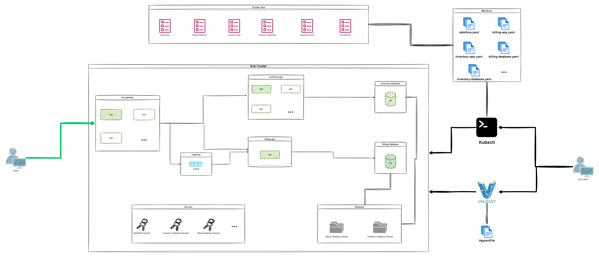

<!-- ctrl + shift + v to preview -->
# kubernetes-microservice-architecture

## Table of Contents
- [kubernetes-microservice-architecture](#kubernetes-microservice-architecture)
  - [Table of Contents](#table-of-contents)
  - [General Information](#general-information)
  - [Features](#features)
  - [Technologies Used](#technologies-used)
  - [Team \& My Work](#team--my-work)
  - [Main Learnings](#main-learnings)
  - [Setup](#setup)

## General Information
This project was made as a school project in [kood/Jõhvi](https://kood.tech/) (5.8.2023)

The project required me to deploy a [previously](https://github.com/JesusKris/vagrant-microservice-architecture) created microservice architecture which included a gateway, a message queue system RabbitMQ & 2 other services with their own PostgreSQL instances, using K3s. 

K3S is a lightweight version of K8s which has been stripped of many non primary features. It makes it a perfect tool to test things locally or the application does not require a powerhouse such as K8s. 

The infrastructure is provisioned using Vagrant and VirtualBox.

I was required to push microservices docker images to Dockerhub, build k8s manifests for each microservice and create a quick deployment using Vagrant.

The cluster is managed using a CLI tool **kubectl**. kubectl is used from the host machine.



  **NB! Different source control platform was used hence no commit history.**

## Features
- Microservice architecture
- K3s powered cluster
- Automatic infrastrcture provisioning using Vagrant
- Message queue system

## Technologies Used

[Docker](https://www.docker.com/)

[Docker Compose](https://docs.docker.com/compose/)

[Dockerhub](https://hub.docker.com/)

[kubectl](https://kubernetes.io/docs/tasks/tools/)

[K3S](https://k3s.io/)

[Vagrant](https://www.vagrantup.com/)

[Node.js](https://nodejs.org/en)

[PostgreSQL](https://www.postgresql.org/)

[RabbitMQ](https://www.rabbitmq.com/)


## Team & My Work
This was a solo project.

I did everything myself.

## Main Learnings
- Basics of kubernetes components, networking, manifests
- kubectl

## Setup
Clone the repository
```
git clone https://github.com/JesusKris/kubernetes-microservice-architecture.git
```
Install VirtualBox
```
sudo apt install virtualbox
```

Install vagrant
```
sudo apt install vagrant
```

Install kubectl
```bash
curl -LO "https://dl.k8s.io/release/$(curl -L -s https://dl.k8s.io/release/stable.txt)/bin/linux/amd64/kubectl"
```

Rename .env-example to .env

Deploy the microservices
```
vagrant up --provider virtualbox
```